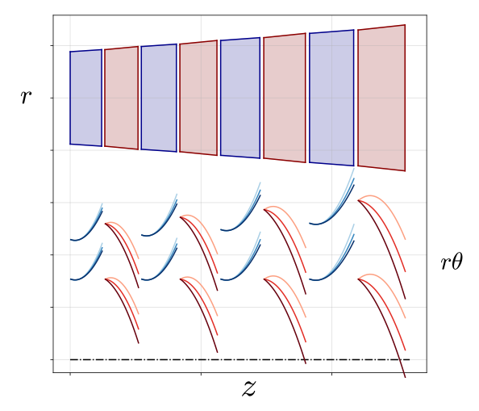

# ADeT
**A**utodiff **De**signer for **T**urbomachinery

A Python library for equation-oriented modeling, with a focus on turbomachinery problems.

<p align="center">
    
</p>

## Features

- **Flexible**: Model turbines and compressors of axial, mixed-flow or radial type 
- **Equation-oriented**: Define physics symbolically with residual equations
- **CoolProp**: Integration of real gas properties
- **Automatic differentiation**: Fully differentiable formulation through [CasaDi](https://web.casadi.org/)
- **Unit-aware**: [Pint](https://github.com/hgrecco/pint) integration for automatic unit checking and conversion
- **Modular**: Define your own components and assemble them


## Getting Started

Check out the **[DOCUMENTATION](https://fvaccari1.bitbucket.io/index.html)**


### Installation
This project uses [uv](https://docs.astral.sh/uv) for packaging and dependency management.

1. Clone this repository
2. [Install `uv`](https://docs.astral.sh/uv/getting-started/installation/)
3. Navigate to the project root directory
4. Install dependencies:
   ```bash
   uv sync                    # Install base dependencies
   uv sync --all-groups       # Install dev and docs dependencies
   ```
> **Note**: To access [REFPROP](https://www.nist.gov/srd/refprop) through CoolProp, see the [integration guide](https://coolprop.org/coolprop/REFPROP.html).

## Development

We use the following development tools:

- **[Ruff](https://docs.astral.sh/ruff)**: Linting and formatting
- **[ty](https://github.com/bnemetis/ty)**: Static type checking

Rules are included in `pyproject.toml` and should be read automatically. 
These tools can be used via CLI or integrated directly into your IDE.
